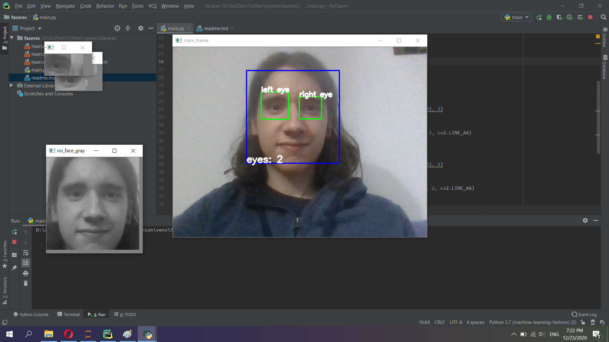

<h1>Eye Tracker</h1>
<h2>Description</h2>

  Application that allows the user to move the cursor around the screen
   by moving their eyes and click by closing their eyelids.

<h2>Demo</h2>

<h3>Pipeline</h3>
<ul>
<li>Use Haar Cascade Object Detection for detecting face and eye features (done)</li>
<li>Crop eyes out of live-motion video</li>
<li>Use Gabor Filters and Support Vector Machines to detect eyes</li>
<li>Compute gaze coordinates and render dot on screen correspondingly</li>
</ul>

<h3>Some implementation details</h3>
<ul>
<li>At the beginning the user will look towards the four corners of the screen in front of him (Top-Right -> blink for one second, Top-Left -> ...)</li>
<li>...</li>
</ul>
